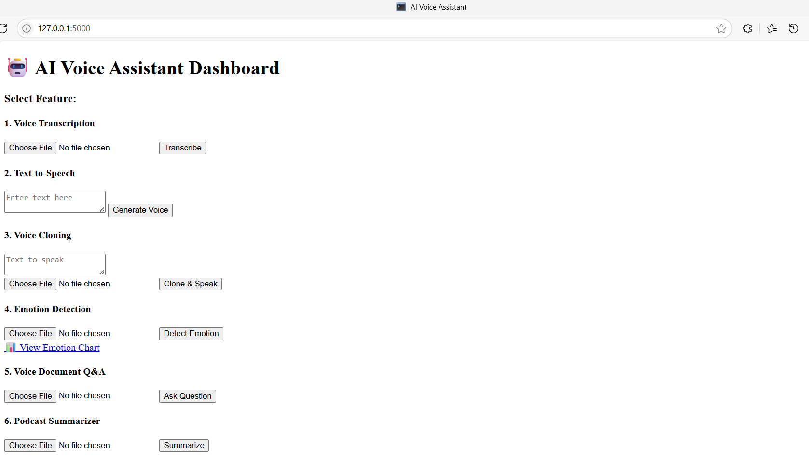

# 🎙️ AI-powered Voice Assistant Suite (6-in-1 Web App)

An AI Voice Assistant web platform combining **6 smart voice modules** including transcription, voice answering, emotion detection, podcast summarization, document Q&A, and voice cloning — all accessible via a lightweight **Flask web interface**.



---

## 📌 Table of Contents

1. [✨ Project Overview](#-project-overview)  
2. [🚀 Features](#-features)  
3. [🗂️ Project Structure](#-project-structure)
4. [🧰 Tech Stack](#-tech-stack)
5. [⚙️ Installation & Setup](#-installation-&-setup)  
6. [✅ Feature Details](#-features-details)
7. [🐛 Known Issues](#-known-issues)
8. [🧭 Future Work](#-future-work)  
9. [📄 License](#-license)
10. [🤝 Contributing](#-contributing)
11. [📬 Contact](#-contact)

---

## ✨ Project Overview

### 1. This voice assistant toolkit empowers users with:
- Transcription from audio to text
- Conversational voice responses
- Real-time Q&A over documents via speech
- Emotion detection via CNN model
- Long podcast summarization
- Voice cloning and TTS using speaker sample
### 2. Accessible through a simple Flask UI for demonstration & prototyping.

---

## 🚀 Features

| Feature Name                         | Description                                                | Technique/Model Used                                  |
|--------------------------------------|------------------------------------------------------------|--------------------------------------------------------
| **Voice Transcription**              | Convert audio (mic/file) into text                         | ``Whisper`` (openai/whisper base)                     |   
| **Text-to-Speech (TTS) Answering**   | Generate voice output from text                            | ``CoquiTTS`` / ``Tacotron2-DDC``                      |
| **Voice Cloning**                    | Clone user voice & read text                               | ``YourTTS`` / ``speaker_wav`` TTS synthesis           |
| **Emotion Detection**                | Detect emotion from voice (e.g., angry, sad)               | ``CNN`` + ``MFCC`` (custom trained on RAVDESS)        |
| **Document Q&A**                     | Ask voice-based questions over documents                   | ``Whisper`` + ``ChromaDB`` + ``SentenceTransformer``  |
| **Podcast Summarizer**               | Transcribe & summarize long podcasts into bullet summary   | ``Whisper`` + ``BART``/``DistilBART`` summarizer      |


---
## 🗂️ Project Structure
```
├── flask_app.py                  # Flask web app
├── images/                     
├── ravdess-data/                     # RAVDESS dataset
├── templates/                     # HTML interface
├── static/                        # Output audio files
├── uploads/                       # Uploaded inputs
├── voice_transcriber.py           # Feature 1
├── Text_to_Speech_generator.py    # Feature 2
├── voice_cloner.py                # Feature 3
├── emotion_detector.py       # Feature 4 (CNN)
├── voice_rag_agent.py            # Feature 5
├── podcast_summarizer.py         # Feature 6
├── train_emotion_cnn.py          # CNN training script
├── train_emotion_model.py          # RandomForest training script
├── emotion_cnn.pth               # Trained CNN weights
├── emotion_label_encoder.pkl     # Label encoder for emotion
├── requirements-ai.txt                     # Python dependencies
└── README.md
└── LICENSE

```
---

## 🧰 Tech Stack

| Purpose                  | Libraries Used                                        |
|--------------------------|-------------------------------------------------------|
| **Transcription**        | ``whisper``, ``ffmpeg``                               |
| **Text-to-Speech**       | ``TTS``, ``CoquiTTS``                                 |
| **Cloning**              | ``yourTTS``, `sentence-transformers`, `transformers`  |
| **Q&A, Embedding**       | ``EasyOCR``, ``OpenCV``                               |
| **Emotion Detection**    | ``PyTorch``, ``librosa``, `scikit-learn``, `joblib``  |
| **Summarization**        | ``transformers`` (``distilbart-cnn-12-6``)            |
| **Web UI**               | ``Flask`, ``Jinja2`, `HTML5`                          |


---

## ⚙️ Installation & Setup

```bash
# Clone repository
git clone https://github.com/paht2005/ai-voice-assistant-suite.git
cd ai-voice-assistant-suite

# Install dependencies
pip install -r requirements-ai.txt

# Run Flask web app
python flask_app.py


```
Then open your browser: http://127.0.0.1:5000

---
## ✅ Feature Details

### 1.  Voice Transcription
- Uses Whisper model to transcribe audio files or mic input.
- Auto language detection & punctuation recovery.
### 2. Drug Similarity
```bash
Input: SMILES of Paracetamol
Output: Ibuprofen (0.72), Naproxen (0.68)...
```
### 3. Conversational Doctor
```bash
User: I have a headache
Doctor: Have you also experienced nausea or light sensitivity?
```
### 4. Rule vs LLM Diagnosis
```bash
Rule-based: Flu
LLM-based: Possible viral infection. Rest and hydration advised.
```
### 5. Review Analyzer
```bash
Sentiment: POSITIVE (0.96)
Aspects: ['staff', 'service']
Summary: The service was fast and staff very helpful.
```
### 6. POS Invoice
```bash
Paracetamol x2 = $3.00
ORS Pack x1 = $0.80
Total = $3.80
```
### 7. Churn Prediction
```bash
Input: {'tenure': 1, 'contract': 'month-to-month'}
Result: ⚠️ Leaving Risk
```
### 8. Loan Approval
```bash
Input: age=25, income=50000, credit_score=700
Result: ✅ Approved
```
### 9. Sales Forecast
```bash
Output file: forecast.csv with predicted 'yhat' values
```
### 10. Barcode & Price Scanner
```bash
Output: ['$5.99', '$12.49'] from image with shelf tags
```

--- 
## 🚀 Enhancements in CLI & AP
### CLI Mode (``main_cli_app.py``)
- Select options 1–10 from a simple numbered interface
- Inputs handled via keyboard
- Forecast saved as CSV

### API Mode (``main_api_app.py``)
- Exposes ``/predict_churn``, ``/diagnose``, ``/chat``, ``/forecast``, etc.
- Accepts JSON payloads
- Can be plugged into a frontend later (e.g., React/Flutter)
--- 
## 🧭 Future Work
- ✅ Add user authentication layer
- ✅ Add database backend (SQLite/PostgreSQL)
- 📷 Real-time camera price scanner
- 🌐 Host web UI (Streamlit or Flask Web)
- 🧪 Add automated tests (PyTest)
---
## 📄 License
This project is licensed under the MIT License. See the [LICENSE](./LICENSE) file for details.


---
## 🤝 Contributing
I welcome contributions to improve this project!
Feel free to fork, pull request, or open issues. Ideas welcome!


--- 
## 📬 Contact
- Contact for work: **Nguyễn Công Phát** – congphatnguyen.work@gmail.com
- [Github](https://github.com/paht2005) 
